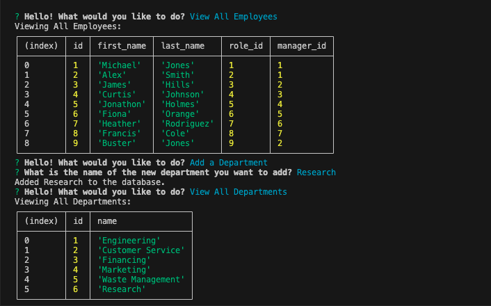

# Employee Tracker

## Description
This is a command-line application that manages a company's database. Using Inquirer, MySQL2, and Console Table, a user can run 'node server.js' and access the command terminal. From there, they can view all departments, view all roles, view all employees, add a new department, role, or employee, and update an existing employee's role. For things like assigning a manager to each new employee, I used the manager id integer, though I was considering allowing the user to enter a manager's name instead. This was an intensive project, and I'd like to develop it further, perhaps giving users the ability to update employee managers, view employees by manager and/or department, deleting departments, roles, and/or employees, etc.

## Screenshot

## Link to Video Demonstration
[Click here to watch a video demonstration of the command line application.](https://drive.google.com/file/d/15FVpAGdEdy41EiFNE1gkL95qUCSNfV4q/view)
